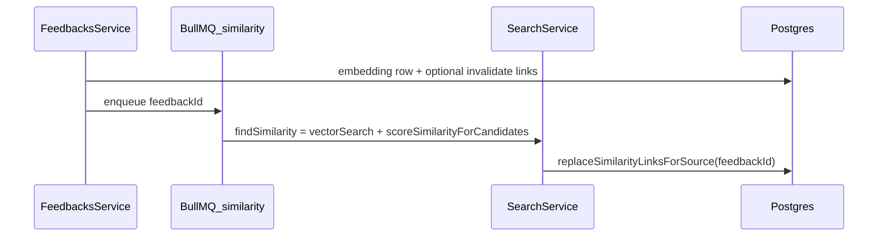

# Kế hoạch: Bulk resolve + similarity pipeline

## Chốt business (nguồn sự thật)

1. **Một dòng link** = kết quả pipeline **từ phía `sourceFeedbackId`** (vector top‑K trong department + rerank Cohere); `score` = `relevanceScore` sau rerank (clamp 0–1). **Không** yêu cầu đối xứng `A↔B` trong DB.
2. **Tạo feedback:** chỉ **một embedding** cho feedback mới; job similarity ghi **`F → *`** (`replaceSimilarityLinksForSource`). **Không** enqueue recompute cho mọi feedback cũ trong phòng ban (tránh fan‑out).
3. **Sửa feedback** (subject/description/`departmentId` làm đổi embed): **`invalidateSimilarityForFeedback(X)`** — xóa mọi link có `X` là **source hoặc target**; cập nhật embedding; enqueue **`recomputeOutgoingSimilarity(X)`** (`findSimilarity` + `replaceSimilarityLinksForSource`).
4. **Đọc “liên quan” trên UI/API:** query **`sourceFeedbackId = id OR targetFeedbackId = id`**, gom theo peer; nếu tồn tại **hai cạnh** (`id→peer` và `peer→id`) thì **`score = max(score)`** (ghi rõ trong code/spec).
5. **Phase 2 (tùy chọn):** sau khi `X` đổi, làm mới điểm các cạng **`* → X`** trong DB (danh sách `source` distinct từ link cũ trước invalidate, hoặc query lịch sử) bằng `scoreSimilarityForCandidateIds(source, [X])` + `replaceSimilarityLinksForTarget(X, sources)` — tốn Cohere theo số source; có thể hoãn bằng cron / MVP chỉ invalidate + outgoing + đọc hai chiều.

## Bối cảnh code hiện tại

- [`feedbacks.service.ts`](backend/src/modules/feedbacks/feedbacks.service.ts): `createFeedback` embed đồng bộ + toxic queue; **chưa** queue similarity. `updateFeedback` **chưa** cập nhật embedding / links. `deleteFeedback`: cascade xóa embedding + links nếu FK đúng.
- [`search.service.ts`](backend/src/modules/search/search.service.ts): đã có `vectorSearch`, `scoreSimilarityForCandidates`, `scoreSimilarityForCandidateIds`, `findSimilarity` (ghép vector + rerank), `replaceSimilarityLinksForSource`, `replaceSimilarityLinksForTarget`; SQL có `LIMIT`, threshold, filter status / department.
- Schema: [`FeedbackSimilarityLink`](backend/prisma/schema.prisma) — `score` đơn, unique `(sourceFeedbackId, targetFeedbackId)`.

## Luồng mục tiêu (tóm tắt)

## Task triển khai (cập nhật)

1. ~~Chốt score / threshold / topK / filter status~~ — đã thể hiện bằng constants trong `SearchService`.

2. ~~Tách vector + rerank~~ — `vectorSearch` + `scoreSimilarityForCandidates`; `findSimilarity` gọi cả hai.

3. ~~Persistence theo source; thay toàn bộ incoming theo target~~ — `replaceSimilarityLinksForSource`, `replaceSimilarityLinksForTarget`.

4. **Gom API đồng bộ (khuyến nghị)**  
   Trong `SearchService` (hoặc service nhỏ inject Prisma):
   - `invalidateSimilarityForFeedback(id)` — `deleteMany` với `OR` source/target.
   - `recomputeOutgoingSimilarity(id)` — `findSimilarity(id)` → `replaceSimilarityLinksForSource(id, targets)`.

5. **Queue `feedback-similarity` + processor**  
   Job payload `{ feedbackId }` → `recomputeOutgoingSimilarity` (retry/backoff giống toxic). Export `SearchService` từ `SearchModule` nếu cần.

6. **`createFeedback`**  
   Sau embed: `queue.add('recomputeSimilarity', { feedbackId })` — không chặn response.

7. **`updateFeedback`**  
   Nếu đổi field ảnh hưởng embedding: transaction — `invalidateSimilarityForFeedback` → cập nhật `FeedbackEmbeddings` → enqueue job trên.  
   **Tùy chọn:** job (hoặc bước 2) repair `*→X` như mục “Phase 2” ở trên.

8. **`deleteFeedback`**  
   Xác nhận cascade; không thêm logic nếu FK đủ.

9. **Staff API related**  
   `GET .../feedbacks/:id/related`: query **hai chiều**, include `Feedbacks` peer, filter department/status/guard giống danh sách staff; response gom peer + **`max(score)`** khi trùng cặp.

10. **Bulk resolve**  
    DTO `feedbackIds[]`, `status`, `note?`; reuse `updateStatus` + event per id; endpoint trong `feedback_management`.

11. **Kiểm thử & vận hành**  
    Mock Cohere / Prisma cho unit; E2E nhẹ khi có API key; ghi chú Redis + worker.

## Việc tùy chọn (sau MVP)

- Cron đêm: `recomputeOutgoingSimilarity` cho feedback mở trong department (bù trường hợp chỉ có `B→A` chưa có `A→B`).
- Forward sang department khác: enqueue lại similarity cho feedback bị forward.
- Chỉ chạy similarity sau toxic approve.
- Migration `init_vector_db`: `CREATE EXTENSION vector` đầu file cho shadow DB.
